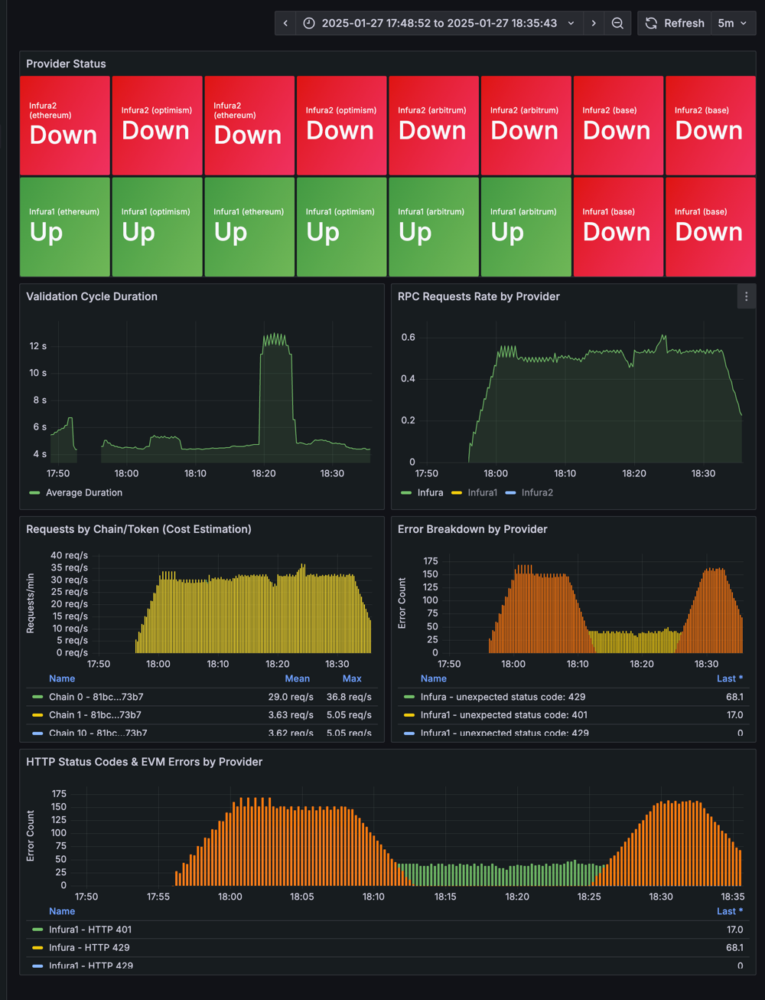

# Ethereum RPC Proxy 

The Ethereum RPC Proxy System provides a robust solution for managing and monitoring Ethereum RPC providers. It consists of two main components:
1. **RPC Health Checker**: Monitors and validates RPC provider health
2. **nginx-proxy**: Acts as a reverse proxy with provider failover capabilities

## Running on the local machine

Run the complete system:

1. Generate provider configuration files and store them in the secrets folder:
   ```bash
   # Create secrets directory if it doesn't exist
   mkdir -p secrets
   
   # Generate default_providers.json 
   python3 rpc-health-checker/generate_providers.py \
     --providers infura:YOUR_INFURA_TOKEN \
     --networks mainnet sepolia \
     --chains ethereum optimism arbitrum base \
     --output secrets/default_providers.json
     
   # Generate reference_providers.json
   python3 rpc-health-checker/generate_providers.py \
     --single-provider \
     --providers infura:YOUR_INFURA_TOKEN_REFERENCE  \
     --networks mainnet sepolia \
     --chains ethereum optimism arbitrum base \
     --output secrets/reference_providers.json
    ``` 
   Please replace `YOUR_INFURA_TOKEN` and `YOUR_INFURA_TOKEN_REFERENCE` with your Infura API tokens. You can also add more providers (infura or grove), see `--providers` flag help.
   Note: `--providers` accepts multiple chain:token pairs. For example, `--providers infura:TOKEN1 infura:TOKEN2 grove:TOKEN3 nodefleet:TOKEN4`
2. 
3. Create .htpasswd file for nginx proxy authentication:
   ```bash
   htpasswd -c secrets/.htpasswd dev
   ```
3. Execute the following commands to start the system:
    ```bash
    docker-compose up --build
    ```
4. Run test requests:
    ```bash
    curl -u dev:<password> -X POST http://localhost:8080/ethereum/mainnet \
    -H "Content-Type: application/json" \
    -d '{"jsonrpc":"2.0","method":"eth_blockNumber","params":[],"id":1}'
    ```
The services will be accessible under:
- RPC Health Checker: http://localhost:8081
  - Check the list of validated providers at http://localhost:8081/providers
- nginx-proxy: http://localhost:8080
  - The new RPC endpoint is now available http://localhost:8080/ethereum/mainnet (path is `/chain/network`)
- Prometheus: http://localhost:9090
  - Metrics and monitoring interface
- Grafana: http://localhost:3000 (default credentials: admin/admin)
  - Visualization dashboards for RPC metrics and health status




## Sub projects

- [RPC Health Checker](rpc-health-checker/README.md)
- [nginx-proxy](nginx-proxy/README.md)
