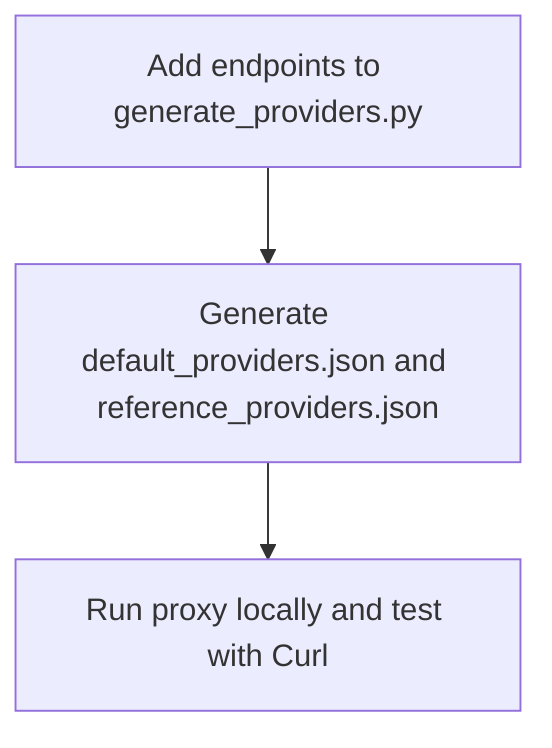

# Adding New Chains to eth-rpc-proxy

This guide explains how to add new blockchain networks to the eth-rpc-proxy system, how to test them, and how to verify they're working correctly.

## Overview

The eth-rpc-proxy system supports multiple blockchain networks and provides fallback functionality between different RPC providers. When adding a new chain, you need to:

1. Update the `generate_providers.py` script with the new chain information
2. Generate the updated providers configuration files
3. Test the proxy with the new chains



## Step 1: Update the `generate_providers.py` Script

The `generate_providers.py` script contains a `NETWORK_DATA` array that defines all supported chains. To add a new chain:

1. Open `rpc-health-checker/generate_providers.py`
2. Add new entries to the `NETWORK_DATA` array for your chain (both mainnet and testnet if applicable)
3. The script will automatically generate the choices for both `--chains` and `--networks` parameters from the `NETWORK_DATA` array, and will update the help text for `--providers` to include all supported provider types

Example of adding a new chain:

```python
NETWORK_DATA = [
    # ... existing chains ...
    {
        "chain": "newchain",
        "network": "mainnet",
        "chainId": 12345,  # Replace with actual chain ID
        "providers": {
            INFURA: "https://newchain-mainnet.infura.io/v3/",
            GROVE: "https://newchain.rpc.grove.city/v1/",
            NODEFLEET: "https://newchain-mainnet.alphafleet.io/",
            ALCHEMY: "https://newchain-mainnet.g.alchemy.com/v2/"
        }
    },
    {
        "chain": "newchain",
        "network": "sepolia",  # Or other testnet
        "chainId": 54321,  # Replace with actual testnet chain ID
        "providers": {
            INFURA: "https://newchain-sepolia.infura.io/v3/",
            GROVE: "https://newchain-sepolia-testnet.rpc.grove.city/v1/",
            NODEFLEET: "https://newchain-sepolia.alphafleet.io/",
            ALCHEMY: "https://newchain-sepolia.g.alchemy.com/v2/"
        }
    },
]

```

## Step 2: Generate configuration files

Here is the commands to generate the provider configuration files. Update it to include your new chain:

```bash
# default_providers.json
python3 rpc-health-checker/generate_providers.py \
   --providers grove:GROVE_TOKEN \
               alchemy:ALCHEMY_TOKEN \
               nodefleet:STATUS_USER:STATUS_PASSWORD \
               infura:INFURA_TOKEN \
               status_network \
   --networks mainnet sepolia \
   --chains ethereum optimism arbitrum base status NEW_CHAIN_HERE \
   --output secrets/default_providers.json


# reference_providers.json 
python3 rpc-health-checker/generate_providers.py \
   --single-provider \
   --providers infura:INFURA_REF_TOKEN status_network \
   --networks mainnet sepolia \
   --chains ethereum optimism arbitrum base status NEW_CHAIN_HERE \
   --output secrets/reference_providers.json
```

Simply add your new chain name to the `--chains` parameter in both commands. If you're adding a new network type (other than mainnet or sepolia), add it to the `--networks` parameter as well.


This will create or update the following files:
- `secrets/default_providers.json`: Contains the multi-provider configuration
- `secrets/reference_providers.json`: Contains the single-provider configuration

Make sure that both filesa above contain entries for the new chains.

## Step 3: Testing with Docker Compose

### Starting the Proxy for Local Testing

For local testing, use the local Docker Compose configuration:

```bash
docker compose -f docker-compose-local.yml up -d --build
```

This will build and start all the necessary services for local testing.

### Setting Up Authentication

Before testing, you need to generate a password in the `secrets/.htpasswd` file:

```bash
# Install htpasswd if not already installed
# On Debian/Ubuntu: apt-get install apache2-utils
# On macOS: brew install httpd

# Generate password file
htpasswd -c secrets/.htpasswd your_username
```

You'll be prompted to enter and confirm a password. This will be used for authenticating your requests to the proxy.

### Making Curl Requests to Test the Proxy

You can test the proxy by making curl requests to localhost. Here are some examples:

#### 1. Get the Block Number for a Chain

```bash
curl -X POST http://localhost:8080/NEW_CHAIN/mainnet \
  -H "Content-Type: application/json" \
  -u your_username:your_password \
  -d '{"jsonrpc":"2.0","method":"eth_blockNumber","params":[],"id":1}'
```

Make sure to replace `your_username` and `your_password` with the credentials you set up in the `.htpasswd` file.

