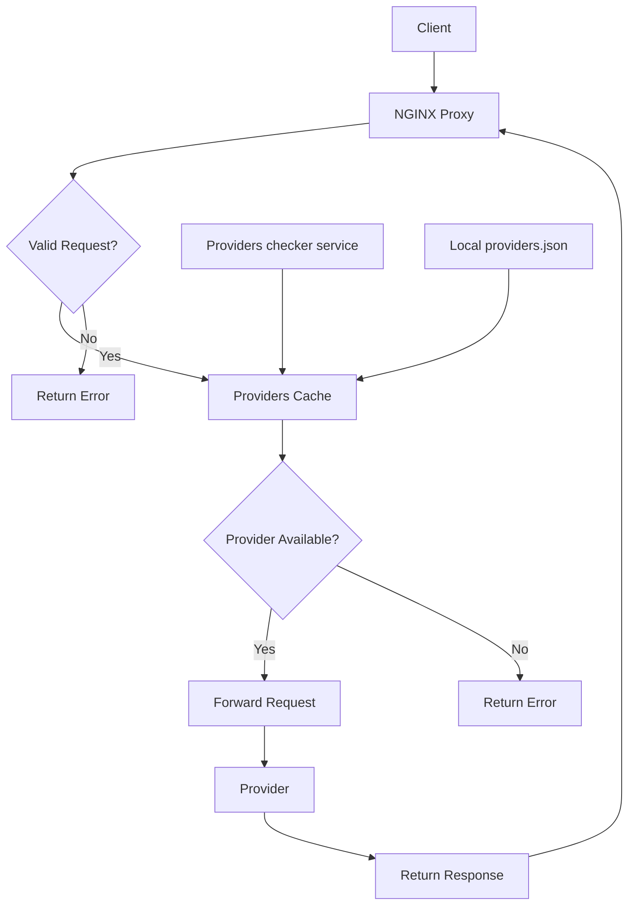
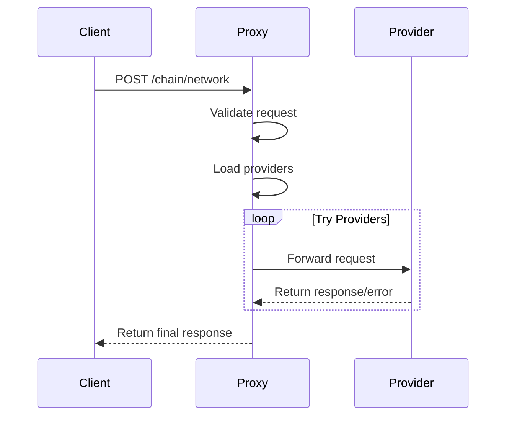

# Nginx RPC Proxy

A reverse proxy for handling RPC requests with provider failover and configuration reloading.

## How It Works



The nginx RPC proxy handles requests through the following process:

1. Receives HTTP POST requests with chain/network in the URL path (format: `/chain/network`)
2. Validates the chain/network format
3. Looks up available providers for the requested chain/network combination
4. Attempts to forward the request to the first available provider
5. If the provider fails, automatically tries the next provider in the list
6. Returns the successful provider's response to the client
7. If all providers fail, returns an error response
8. Periodically reloads provider configuration to maintain up-to-date provider lists

## Local Development

To run locally:

```bash
./build_docker_locally_run.sh
```

This will:
1. Create a Docker network
2. Build the Docker image
3. Remove any existing container
4. Start the proxy on port 8080

## Deployment

1. Build the Docker image:
```bash
docker build -t rpc-proxy .
```

2. Run the container:
```bash
docker run -d --name rpc-proxy \
  --network rpc-network \
  -p 8080:8080 \
  -e CONFIG_HEALTH_CHECKER_URL=http://config-health-checker:8080/providers \
  rpc-proxy
```

## Provider List Configuration

The proxy fetches providers from:
1. Primary source: URL specified in CONFIG_HEALTH_CHECKER_URL environment variable
2. Fallback: Local providers.json file

### Provider List Format

The providers list is a JSON file with the following structure:
```json
{
  "chains": [
    {
      "name": "chain-name-lowercase",
      "network": "network-name-lowercase",
      "providers": [
        {
          "url": "http://provider1",
          "authType": "no-auth|token-auth|basic-auth",
          "authToken": "optional-token",
          "authLogin": "optional-username",
          "authPassword": "optional-password"
        }
      ]
    }
  ]
}
```

## Request Flow



## Request Format

Requests must be in the format:
```
POST /chain/network
```

With JSON body containing the RPC request.

Example:
```bash
curl -X POST http://localhost:8080/ethereum/mainnet \
  -H "Content-Type: application/json" \
  -d '{"jsonrpc":"2.0","method":"eth_blockNumber","params":[],"id":1}'
```

## Authentication

The proxy requires HTTP basic authentication. Credentials are stored in `.htpasswd`.
