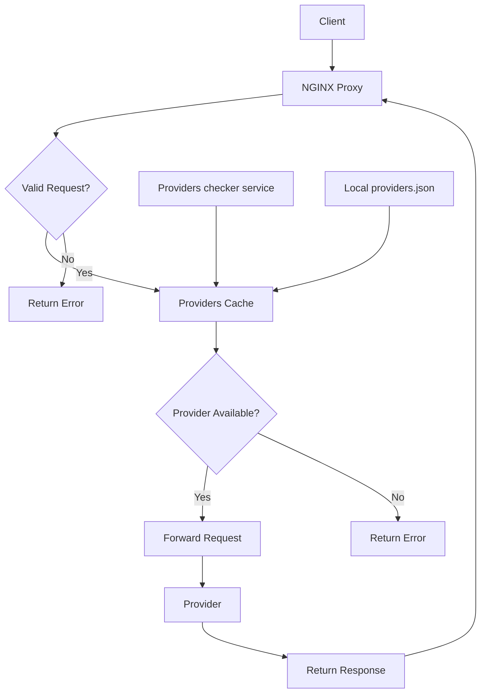
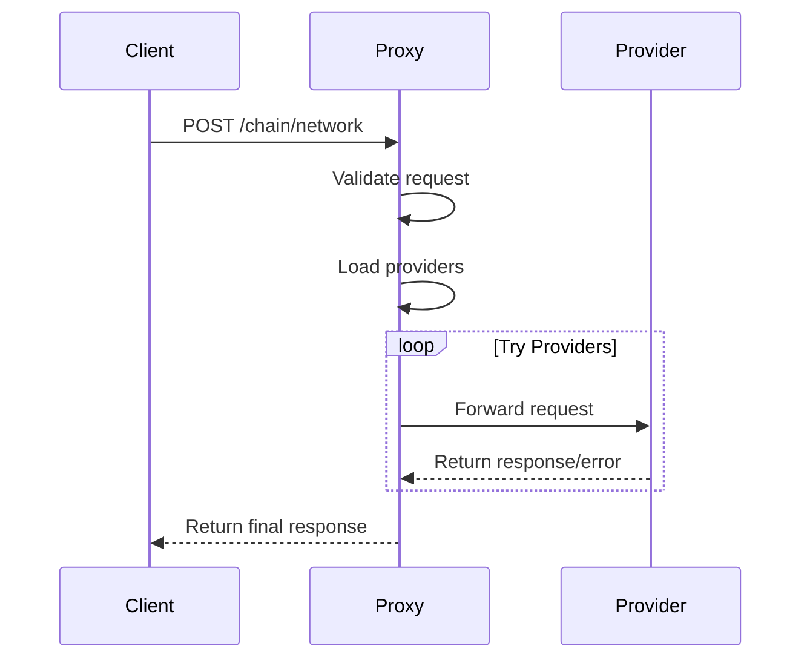

# Nginx RPC Proxy

A reverse proxy for handling RPC requests with provider failover and configuration reloading.

## How It Works



The nginx RPC proxy handles requests through the following process:

1. Receives HTTP POST requests with chain/network in the URL path:
   - Format 1: `/chain/network` - uses any available provider with failover across all providers
   - Format 2: `/chain/network/provider_type` - uses providers of the specified type with failover between instances of that type
2. Validates the chain/network format
3. Looks up available providers for the requested chain/network combination
4. For requests without provider_type:
   - Attempts to forward the request to each available provider in sequence
   - Returns the first successful response
   - If all providers fail, returns a 502 error
5. For requests with provider_type:
   - Finds all providers matching the requested type
   - Attempts to forward the request to each matching provider in sequence
   - Returns the first successful response
   - If no matching providers found, returns a 404 error
   - If all matching providers fail, returns a 502 error
6. Periodically reloads provider configuration to maintain up-to-date provider lists

## Local Development

To run locally:

```bash
./build_docker_locally_run.sh
```

This will:
1. Create a Docker network
2. Build the Docker image
3. Remove any existing container
4. Start the proxy on port 8080

## Deployment

1. Build the Docker image:
```bash
docker build -t rpc-proxy .
```

2. Run the container:
```bash
docker run -d --name rpc-proxy \
  --network rpc-network \
  -p 8080:8080 \
  -e CONFIG_HEALTH_CHECKER_URL=http://rpc-health-checker:8080/providers \
  rpc-proxy
```

## Provider List Configuration

The proxy fetches providers from:
1. Primary source: URL specified in CONFIG_HEALTH_CHECKER_URL environment variable
2. Fallback: Local providers.json file

### Provider List Format

The providers list is a JSON file with the following structure:
```json
{
  "chains": [
    {
      "name": "chain-name-lowercase",
      "network": "network-name-lowercase",
      "providers": [
        {
          "type": "provider-type",
          "name": "provider-name",
          "url": "http://provider1",
          "authType": "no-auth|token-auth|basic-auth",
          "authToken": "optional-token",
          "authLogin": "optional-username",
          "authPassword": "optional-password"
        }
      ]
    }
  ]
}
```

## Request Flow



## Request Format

Requests must be in one of two formats:
```
POST /chain/network
POST /chain/network/provider_type
```

With JSON body containing the RPC request.

Examples:
```bash
# Use any available provider with failover
curl -X POST http://localhost:8080/ethereum/mainnet \
  -H "Content-Type: application/json" \
  -d '{"jsonrpc":"2.0","method":"eth_blockNumber","params":[],"id":1}'

# Use Infura providers with failover between Infura instances
curl -X POST http://localhost:8080/ethereum/mainnet/infura \
  -H "Content-Type: application/json" \
  -d '{"jsonrpc":"2.0","method":"eth_blockNumber","params":[],"id":1}'
```

## Authentication

The proxy requires HTTP basic authentication. Credentials are stored in `.htpasswd`.
