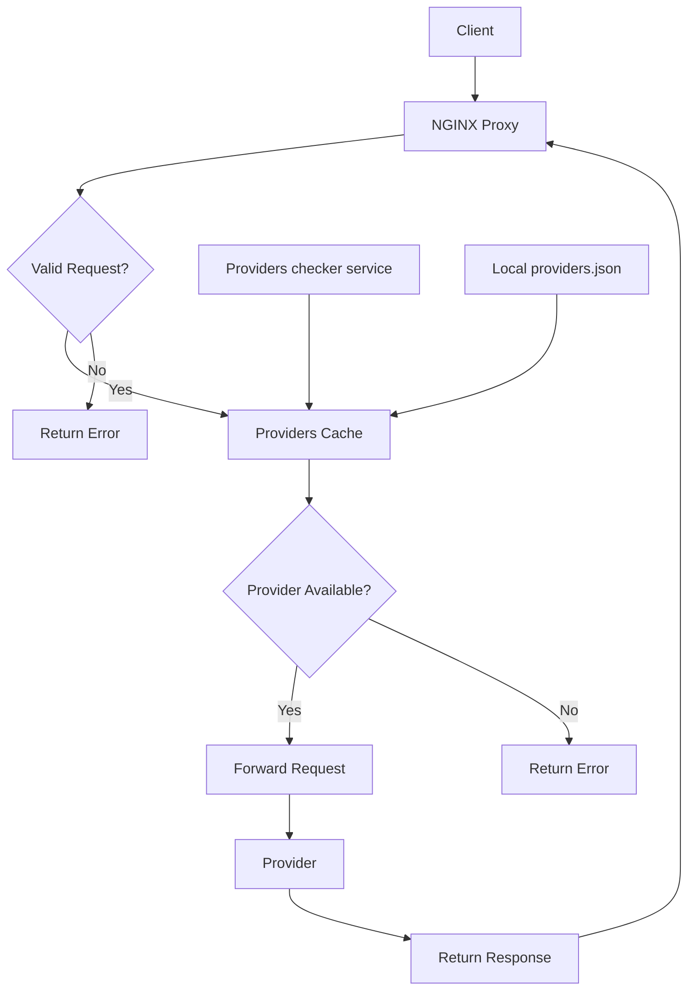
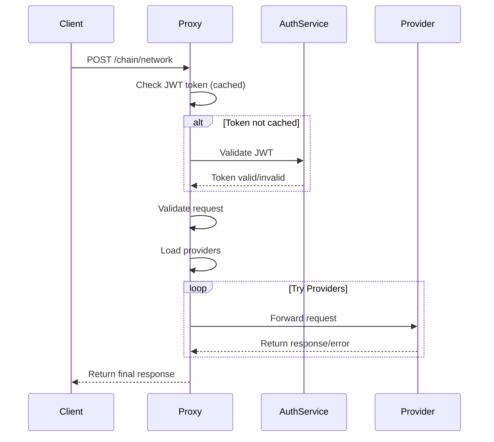

# Nginx RPC Proxy

A reverse proxy for handling RPC requests with provider failover, configuration reloading, and JWT-based authentication.

## How It Works



The nginx RPC proxy handles requests through the following process:

1. Receives HTTP POST requests with chain/network in the URL path:
   - Format 1: `/chain/network` - uses any available provider with failover across all providers
   - Format 2: `/chain/network/provider_type` - uses providers of the specified type with failover between instances of that type
2. Validates the chain/network format
3. Looks up available providers for the requested chain/network combination
4. For requests without provider_type:
   - Attempts to forward the request to each available provider in sequence
   - Returns the first successful response
   - If all providers fail, returns a 502 error
5. For requests with provider_type:
   - Finds all providers matching the requested type
   - Attempts to forward the request to each matching provider in sequence
   - Returns the first successful response
   - If no matching providers found, returns a 404 error
   - If all matching providers fail, returns a 502 error
6. Periodically reloads provider configuration to maintain up-to-date provider lists

## Authentication Configuration

The proxy now supports JSON-based configuration for authentication settings, shared with the Go Auth Service:

### Environment Variables

- `AUTH_CONFIG_FILE` - Path to JSON configuration file (default: `/app/auth_config.json`)
- `GO_AUTH_SERVICE_URL` - URL for Go Auth Service (default: `http://go-auth-service:8081`)
- `CONFIG_HEALTH_CHECKER_URL` - URL for provider health checker
- `CUSTOM_DNS` - Custom DNS servers for provider resolution
- `RELOAD_INTERVAL` - Provider list reload interval in seconds

### JSON Configuration

The proxy reads authentication settings from a shared JSON configuration file:

```json
{
  "algorithm": "argon2id",
  "jwt_secret": "supersecret",
  "puzzle_difficulty": 2,
  "requests_per_token": 100,
  "token_expiry_minutes": 10,
  "argon2_params": {
    "memory_kb": 32768,
    "time": 1,
    "threads": 4,
    "key_len": 32
  }
}
```

**Used by nginx:**
- `requests_per_token` - Maximum requests per JWT token before rate limiting
- `token_expiry_minutes` - JWT token cache TTL in nginx shared memory

**Used by Go Auth Service:**
- All other parameters for puzzle generation and token validation

## Local Development

To run locally:

```bash
./build_docker_locally_run.sh
```

This will:
1. Create a Docker network
2. Build the Docker image
3. Remove any existing container
4. Start the proxy on port 8080

## Deployment

1. Build the Docker image:
```bash
docker build -t rpc-proxy .
```

2. Run the container:
```bash
docker run -d --name rpc-proxy \
  --network rpc-network \
  -p 8080:8080 \
  -e CONFIG_HEALTH_CHECKER_URL=http://rpc-health-checker:8080/providers \
  -e GO_AUTH_SERVICE_URL=http://go-auth-service:8081 \
  -e AUTH_CONFIG_FILE=/app/auth_config.json \
  -v ./auth_config.json:/app/auth_config.json:ro \
  rpc-proxy
```

## Provider List Configuration

The proxy fetches providers from:
1. Primary source: URL specified in CONFIG_HEALTH_CHECKER_URL environment variable
2. Fallback: Local providers.json file

### Provider List Format

The providers list is a JSON file with the following structure:
```json
{
  "chains": [
    {
      "name": "chain-name-lowercase",
      "network": "network-name-lowercase",
      "providers": [
        {
          "type": "provider-type",
          "name": "provider-name",
          "url": "http://provider1",
          "authType": "no-auth|token-auth|basic-auth",
          "authToken": "optional-token",
          "authLogin": "optional-username",
          "authPassword": "optional-password"
        }
      ]
    }
  ]
}
```

## Request Flow



## Request Format

Requests must be in one of two formats:
```
POST /chain/network
POST /chain/network/provider_type
```

With JSON body containing the RPC request.

Examples:
```bash
# Use any available provider with failover
curl -X POST http://localhost:8080/ethereum/mainnet \
  -H "Content-Type: application/json" \
  -d '{"jsonrpc":"2.0","method":"eth_blockNumber","params":[],"id":1}'

# Use Infura providers with failover between Infura instances
curl -X POST http://localhost:8080/ethereum/mainnet/infura \
  -H "Content-Type: application/json" \
  -d '{"jsonrpc":"2.0","method":"eth_blockNumber","params":[],"id":1}'
```

## Authentication

The proxy supports hybrid authentication:

### 1. Basic Authentication
Uses `.htpasswd` file for credentials:
```bash
curl -X POST http://localhost:8080/ethereum/mainnet \
  -u username:password \
  -H "Content-Type: application/json" \
  -d '{"jsonrpc":"2.0","method":"eth_blockNumber","params":[],"id":1}'
```

### 2. JWT Token Authentication
Requires solving an Argon2 puzzle to obtain a JWT token:

1. Get puzzle: `GET /auth/puzzle`
2. Solve puzzle using Argon2id algorithm
3. Submit solution: `POST /auth/solve`
4. Use returned JWT token in requests:

```bash
curl -X POST http://localhost:8080/ethereum/mainnet \
  -H "Authorization: Bearer <jwt-token>" \
  -H "Content-Type: application/json" \
  -d '{"jsonrpc":"2.0","method":"eth_blockNumber","params":[],"id":1}'
```

## Configuration Management

The nginx proxy uses Lua modules to manage configuration:

- `auth_config.lua` - Reads JSON config and provides authentication settings
- `auth_token_validator.lua` - Validates JWT tokens with caching and rate limiting
- `provider_loader.lua` - Manages provider list reloading
- `request_handler.lua` - Handles main request routing logic

Configuration is loaded once at worker startup and cached for performance.
