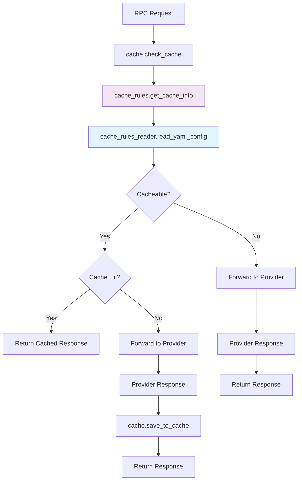

# RPC Cache System

## Overview
The RPC caching system uses **YAML-based configuration** with **Lua shared memory**, providing **network-specific TTL strategies** and three cache types optimized for different blockchain networks and data types. The system is now fully configurable without code changes.

## Architecture



## YAML Configuration System

### Configuration File Structure
The cache rules are defined in `cache_rules.yaml`:

```yaml
# Per-chain TTL defaults (in seconds)
ttl_defaults:
  default: { permanent: 86400, short: 5, minimal: 0 }
  ethereum:mainnet: { short: 15, minimal: 5 }
  arbitrum:mainnet: { short: 1 }
  optimism:mainnet: { short: 1 }
  polygon:mainnet: { short: 2 }

# Method classifications
cache_rules:
  # Permanent: Immutable blockchain data
  eth_getBlockByHash: permanent
  eth_getTransactionReceipt: permanent
  net_version: permanent
  
  # Short: Semi-static data with network-specific TTL
  eth_getBalance: short
  eth_blockNumber: short
  eth_call: short
  
  # Minimal: Highly dynamic data
  eth_gasPrice: minimal
  eth_feeHistory: minimal
  eth_maxPriorityFeePerGas: minimal
```

### TTL Resolution Hierarchy
The system resolves TTL values in this priority order:
1. **Network-specific**: `chain:network` (e.g., `ethereum:mainnet`)
2. **Chain-specific**: `chain` (e.g., `ethereum`)  
3. **Default**: `default` fallback values

## Cache Types & Memory

| Type | TTL Range | Shared Dict | Size | Use Case |
|------|-----------|-------------|------|----------|
| **permanent** | 24h (default) | `rpc_cache` | 500MB | Immutable data (blocks, receipts) |
| **short** | 1-15s (network-specific) | `rpc_cache_short` | 250MB | Semi-static data (balances, calls) |
| **minimal** | 0-5s (network-specific) | `rpc_cache_minimal` | 50MB | Dynamic data (gas prices, fees) |

## API Reference

### cache.check_cache(chain, network, body_data)
```lua
local cache_info = cache.check_cache("ethereum", "mainnet", body_data)

-- Returns: { cache_type, cache_key, ttl, cached_response, decoded_body}
```

### cache.save_to_cache(cache_info, response_body)
Unified cache saving with configuration-driven TTL:

```lua
cache.save_to_cache(cache_info.cache_key, response, cache_info.cache_type)
```
### Adding New Networks
Simply extend the YAML configuration:

```yaml
ttl_defaults:
  # existing configs...
  base:mainnet: { short: 2, minimal: 1 }
  avalanche:mainnet: { short: 3, minimal: 1 }
```

## Configuration Management

### Environment Variables
- `CACHE_RULES_FILE`: Path to YAML configuration file (default: `/app/cache_rules.yaml`)

## Monitoring & Metrics

### Cache Statistics
Available via `/metrics/cache` endpoint:

```
nginx_cache_hits_total{cache_type="permanent"} 150
nginx_cache_misses_total{cache_type="short"} 45
nginx_cache_usage_percent{cache_type="minimal"} 23.45
```

## Performance Optimization: Native Nginx Cache

### Current Limitations
- Limited by shared memory size
- JSON decoding overhead
- Lua execution for cache operations

### Proposed Future Enhancement: Native Nginx Cache

**Architecture Concept:**
- 🚀 **Disk-based cache** - unlimited size beyond shared memory
- ⚡ **Zero Lua overhead** for cache hits via native nginx  
- 🔄 **Built-in failover** with `proxy_next_upstream`
- 📊 **Native monitoring** via `$upstream_cache_status`

**Implementation Concept:**

1. **Lua classifier** determines cache type:
```lua
local cache_type = cache_classifier.get_cache_type(body_data)
ngx.exec("@cache_" .. cache_type)  -- Redirect to named location
```

2. **Named locations** with proxy_cache:
```nginx
location @cache_permanent {
    internal;
    proxy_cache eth_cache_permanent;
    proxy_cache_key "$request_method|$request_uri|$request_body";
    proxy_cache_valid 200 24h;
    proxy_next_upstream error timeout http_500-http_504;
    proxy_pass http://eth_dynamic;
}

location @cache_short {
    internal;
    proxy_cache eth_cache_short;
    proxy_cache_valid 200 5s;
    proxy_pass http://eth_dynamic;
}
```

3. **Dynamic upstream** with Lua balancer:
```nginx
upstream eth_dynamic {
    balancer_by_lua_block {
        local providers = get_providers(chain, network)
        balancer.set_current_peer(providers[attempt])
    }
}
```

**Performance Gains:**
- Cache HIT: Direct nginx response (no Lua)
- Cache MISS: Lua only for provider selection
- Automatic failover between providers
- Disk cache scales beyond memory limits 