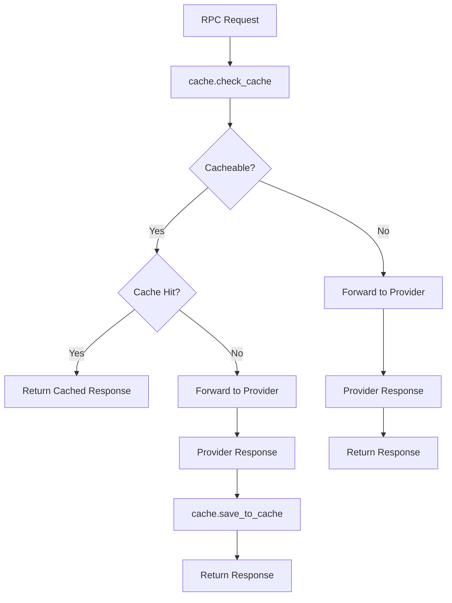

# RPC Cache System

## Overview

The current caching system uses **Lua shared memory** to cache RPC responses with two TTL levels:
- **Permanent cache (24h)** - for immutable blockchain data
- **Short cache (5s)** - for frequently changing data

## Architecture



## Cache Types

| Type | Methods | TTL | Shared Dict |
|------|---------|-----|-------------|
| **permanent** | `eth_getBlockByHash`, `eth_getTransactionReceipt`, `net_version` | 24h | `rpc_cache` (100MB) |
| **short** | `eth_getBlockByNumber`, `eth_getBalance`, `eth_blockNumber` | 5s | `rpc_cache_short` (50MB) |

## API

### check_cache(chain, network, body_data)
```lua
local cache_info = cache.check_cache("ethereum", "mainnet", body_data)
-- Returns: { cache_type, cache_key, ttl, cached_response }
```

### save_to_cache(cache_key, response_body, cache_type)
```lua
cache.save_to_cache(cache_info.cache_key, response, cache_info.cache_type)
```

## Performance Optimization: Native Nginx Cache

### Current Limitations
- Limited by shared memory size
- JSON decoding overhead
- Lua execution for cache operations

### Proposed Solution: Native Nginx + Proxy Cache

**Architecture Benefits:**
- 🚀 **Disk-based cache** - unlimited size
- ⚡ **Zero Lua overhead** for cache hits  
- 🔄 **Built-in failover** with `proxy_next_upstream`
- 📊 **Native monitoring** via `$upstream_cache_status`

**Implementation Concept:**

1. **Lua classifier** determines cache type:
```lua
local cache_type = cache_classifier.get_cache_type(body_data)
ngx.exec("@cache_" .. cache_type)  -- Redirect to named location
```

2. **Named locations** with proxy_cache:
```nginx
location @cache_permanent {
    internal;
    proxy_cache eth_cache_permanent;
    proxy_cache_key "$request_method|$request_uri|$request_body";
    proxy_cache_valid 200 24h;
    proxy_next_upstream error timeout http_500-http_504;
    proxy_pass http://eth_dynamic;
}

location @cache_short {
    internal;
    proxy_cache eth_cache_short;
    proxy_cache_valid 200 5s;
    proxy_pass http://eth_dynamic;
}
```

3. **Dynamic upstream** with Lua balancer:
```nginx
upstream eth_dynamic {
    balancer_by_lua_block {
        local providers = get_providers(chain, network)
        balancer.set_current_peer(providers[attempt])
    }
}
```

**Performance Gains:**
- Cache HIT: Direct nginx response (no Lua)
- Cache MISS: Lua only for provider selection
- Automatic failover between providers
- Disk cache scales beyond memory limits 